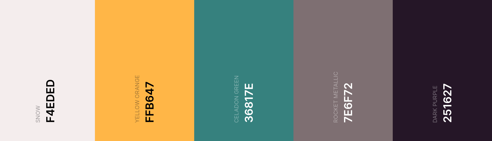
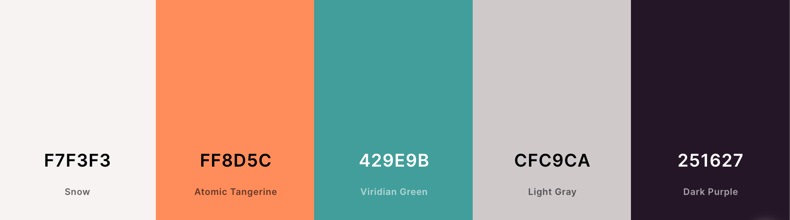

# ItsAlanK React based Portfolio Site

I had to do it eventually so I'm committing to it now. Site is going to be largely React based and serve as a hub for my projects coding and otherwise _(More of them on the to do list too)_

[**Live WIP**](https://itsalank.github.io/portfolio-site/)

---

## Color Palettes

Initial Palette

[Palette Link](https://coolors.co/f4eded-ffb647-36817e-7e6f72-251627)

Starting palette coming from current CV, want to have more pastel final look so will mute colors somewhat.

- Like off white BG
- Yellow could work if a bit more orange for cinematic look and softer for pastel
- Soften green to match orange/yellow
- Dark grey with slight purple/pink warmth v nice
- Almost black purple could maybe be pushed closer to black

Final Palette

[Palette Link](https://coolors.co/f7f3f3-ff8d5c-429e9b-cfc9ca-251627)

---

## Feature List (Planned)

Homepage
- Main Bio w/ Portrait
- Skillset and Education
- Trivia button (Click here for a random fact)
- Projects (recent)

Projects Page
- Full projects list and links to them
- Images and brief desc.

Contact Page
- Contact Form and contact info

Header/Footer
- Nav links
- Social Links

Stretch Feats
- Inverted Mode

## Technologies, Tools and Assets

### Langs and Libs
- [HTML/CSS/JS](https://letmegooglethat.com/?q=What+is+html)
- [React](https://reactjs.org/)
- [React Bootstrap](https://react-bootstrap.github.io/)
- [SASS](https://sass-lang.com/)
### Fonts

- Display Font: [Mendl Sans Dusk](https://fonts.adobe.com/fonts/mendl-sans)
- Body Font: [Raleway](https://fonts.google.com/specimen/Raleway)
- Icons: [Font Awesome](https://fontawesome.com/v5/docs/web/use-with/react)
